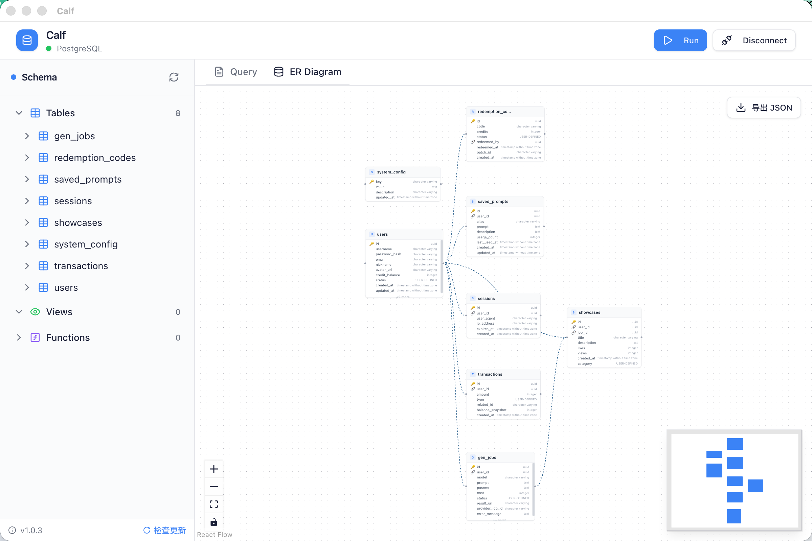

# Calf - PostgreSQL Client

A lightweight, modern PostgreSQL desktop client built with Electron and React.



## Features

- **Database Connection** - Connect to multiple PostgreSQL databases with ease
- **SQL Editor** - Full-featured SQL editor with syntax highlighting (Monaco Editor)
- **ER Diagram** - Visualize database schemas with interactive entity-relationship diagrams
- **Schema Browser** - Navigate tables, views, and functions easily
- **Table Operations** - View data, structure, truncate, or drop tables
- **DDL Generation** - Generate CREATE TABLE statements with one click
- **Auto-Update** - Automatic updates when new versions are released
- **Cross-Platform** - Works on macOS, Windows, and Linux

## Tech Stack

- **Electron** - Desktop framework
- **React 19** - UI framework
- **TypeScript** - Type safety
- **Tailwind CSS** - Styling
- **React Flow** - ER diagram visualization
- **Monaco Editor** - SQL editing
- **Zustand** - State management
- **Electron Builder** - App packaging

## Getting Started

### Prerequisites

- Node.js 18+
- pnpm
- PostgreSQL database (for testing)

### Installation

#### Download Pre-built App

Download the latest release from [GitHub Releases](https://github.com/YanYuanFE/calf/releases)

##### macOS

```bash
# 1. Open the DMG file
# 2. Drag Calf to Applications folder

# 3. If you see "Calf is damaged" error, run:
sudo xattr -rd com.apple.quarantine "/Applications/Calf.app"

# 4. Open the app
open "/Applications/Calf.app"
```

##### Windows

```bash
# Run the .exe installer
```

##### Linux

```bash
# Run the AppImage
chmod +x Calf-*.AppImage
./Calf-*.AppImage
```

#### Build from Source

```bash
# Clone the repository
git clone https://github.com/YanYuanFE/calf.git
cd calf

# Install dependencies
pnpm install

# Start development server
pnpm dev
```

### Building

```bash
# Build for macOS
pnpm build:mac

# Build for Windows
pnpm build:win

# Build for Linux
pnpm build:linux

# Build all platforms
pnpm build
```

### Publishing

```bash
# Set GitHub token
export GH_TOKEN=ghp_xxxxxxxxxxxxxxxxxxxx

# Publish to GitHub Releases
pnpm electron-builder --mac -p always
```

## Keyboard Shortcuts

| Shortcut | Action |
|----------|--------|
| `Cmd/Ctrl + Enter` | Execute SQL |
| `Cmd/Ctrl + K` | Clear editor |
| `Cmd/Ctrl + S` | Save SQL (local) |

## Project Structure

```
calf/
├── electron/
│   ├── main/           # Main process
│   │   ├── database/   # Database operations
│   │   ├── ipc/        # IPC handlers
│   │   └── preload/    # Preload scripts
├── src/
│   ├── components/     # React components
│   │   ├── diagram/    # ER diagram
│   │   ├── editor/     # SQL editor
│   │   ├── layout/     # Layout components
│   │   ├── table/      # Result table
│   │   └── tree/       # Schema tree
│   ├── stores/         # Zustand stores
│   ├── types/          # TypeScript types
│   └── main.tsx        # App entry
├── build/              # Icons and resources
└── package.json
```

## Configuration

### Connection Settings

```json
{
  "host": "localhost",
  "port": 5432,
  "database": "mydb",
  "user": "postgres",
  "password": "yourpassword",
  "ssl": false
}
```

### Environment Variables

| Variable | Description |
|----------|-------------|
| `GH_TOKEN` | GitHub token for auto-updates |

## Auto-Update

Calf uses `electron-updater` for automatic updates. When a new release is published on GitHub, the app will automatically check and prompt for update.

## Contributing

1. Fork the repository
2. Create your feature branch (`git checkout -b feature/amazing-feature`)
3. Commit your changes (`git commit -m 'Add some amazing feature'`)
4. Push to the branch (`git push origin feature/amazing-feature`)
5. Open a Pull Request

## License

MIT License - see [LICENSE](LICENSE) for details.

## Acknowledgments

- [Electron](https://electronjs.org/)
- [React Flow](https://reactflow.dev/)
- [Monaco Editor](https://microsoft.github.io/monaco-editor/)
- [shadcn/ui](https://ui.shadcn.com/)
